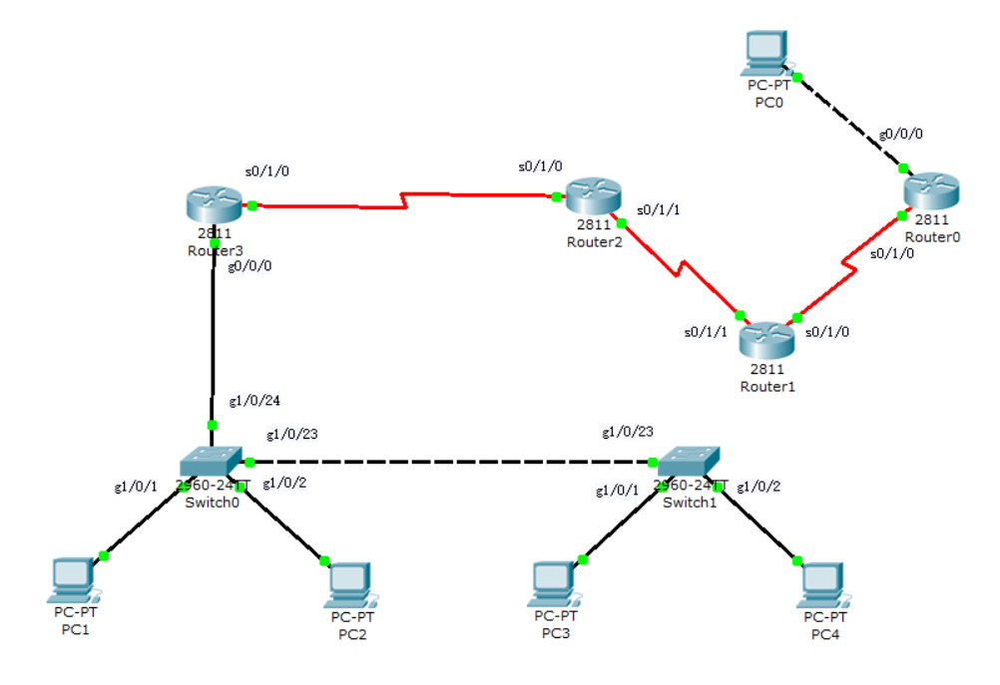

# 实验报告

## 1.小组信息

## 2.实验信息

### 实验要求

1. 拓扑需使用动态路由协议。
2. 拓扑中需包含VLAN及trunk技术。
3. 拓扑至少需包含设备：2台交换机、4台路由器、4台PC。  
4. 每组时间为60分钟。
5. 上机报告需包含拓扑说明、相关路由表信息、连通性说明。提交时现场助教或老师将在现场确认。
6. 完成规定的基本要求为90分
7. 拓扑中设计较为复杂的网络技术（如ACL，NAT等）等将有加分。

### 使用技术

- RIP 路由协议；
- VLAN 间路由技术；
- Trunk 技术；
- NAT 网络地址转换；
- ACL 访问控制列表

## 3.实验拓扑



Router1的s0/1/0和s0/1/1为DCE
Router2的s0/1/0为DCE

## 4.实验步骤

### PC配置

| PC | IP地址 | 子网掩码 | 网关 |
| :-: | :-: | :-: | :-: |
| PC0 | 200.1.1.2 | 255.255.255.0 | 200.1.1.1 |
| PC1 | 192.168.10.2 | 255.255.255.0 | 192.168.10.1 |
| PC2 | 192.168.20.2 | 255.255.255.0 | 192.168.20.1 |
| PC3 | 192.168.10.3 | 255.255.255.0 | 192.168.10.1 |
| PC4 | 192.168.20.3 | 255.255.255.0 | 192.168.20.1 |

### 配置VLAN及trunk

Switch0:

```text
//将Switch0和Switch1之间的链路设置为trunk链路
Switch0(config)#int g1/0/23
Switch0(config-if)#switchport mode trunk

//划分两个Vlan
Switch0(config)#vlan 10
Switch0(config)#vlan 20

//将Switch0的g1/0/1划分入vlan10，g1/0/2划分入vlan20
Switch0(config)#int g1/0/1
Switch0(config-if)#switchport mode access
Switch0(config-if)#switchport access vlan 10
Switch0(config-if)#exit
Switch0(config)#int g1/0/2
Switch0(config-if)#switchport mode access
Switch0(config-if)#switchport access vlan 20
//可使用show vlan brief命令，查看接口是否在正确的vlan中

//将Switch0的g1/0/24接口设置为trunk接口，与Router3互联
Switch0(config)#int g1/0/24
Switch0(config-if)#switchport mode trunk
```

Switch1:

```text
//将Switch0和Switch1之间的链路设置为trunk链路
Switch1(config)#int g1/0/23
Switch1(config-if)#switchport mode trunk

//划分两个Vlan
Switch1(config)#vlan 10
Switch1(config)#vlan 20

//将Switch1的g1/0/1划分入vlan10，g1/0/2划分入vlan20
Switch1(config)#int g1/0/1
Switch1(config-if)#switchport mode access
Switch1(config-if)#switchport access vlan 10
Switch1(config-if)#exit
Switch1(config)#int g1/0/2
Switch1(config-if)#switchport mode access
Switch1(config-if)#switchport access vlan 20
//可使用show vlan brief命令，查看接口是否在正确的vlan中
```

Router3:

```text
//清除Router3的g0/0/0接口的ip配置
Router3(config)#int g0/0/0
Router3(config-if)#no ip add
Router3(config-if)#no shut

//将g0/0/0接口划分为两个子接口
Router3(config)#int g0/0/0.10
Router3(config-subif)#encapsulation dot1q 10
Router3(config-subif)#ip add 192.168.10.1 255.255.255.0
Router3(config-if)#exit
Router3(config)#int g0/0/0.20
Router3(config-subif)#encapsulation dot1q 20
Router3(config-subif)#ip add 192.168.20.1 255.255.255.0
```

### 配置NAT

Router2:

```text
//配置s0/1/0的ip
Router2(config)#int s0/1/0
Router2(config-if)ip add 200.1.4.1 255.255.255.0
Router2(config-if)#clock rate 56000
Router2(config-if)#no shut
```

Router3:

```text
//配置s0/1/0的ip
Router3(config)#int s0/1/0
Router3(config-if)#ip add 200.1.4.2 255.255.255.0
Router3(config-if)#no shut

//配置动态NAT转换地址范围
Router3(config)#access-list 1 permit 192.168.0.0 0.0.255.255
//配置动态NAT转换地址池
Router3(config)#ip nat pool nju 200.1.4.50 200.1.4.100 netmask 255.255.255.0
//配置动态NAT映射
Router3(config)#ip nat inside source list 1 pool nju

//配置内网端口和外网端口
Router3(config)#int s0/1/0
Router3(config-if)#ip nat outside
Router3(config)#int g0/0/0.10
Router3(config-if)#ip nat inside
Router3(config)#int g0/0/0.20
Router3(config-if)#ip nat inside
```

### 配置RIP

Router0:

```text
//配置g0/0/0的ip
Router0(config)#int g0/0/0
Router0(config-if)#ip add 200.1.1.1 255.255.255.0
Router0(config-if)#no shut

//配置s0/1/0的ip
Router0(config)#int s0/1/0
Router0(config-if)#ip add 200.1.2.1 255.255.255.0
Router0(config-if)#no shut

//配置RIP
Router0(config)#router rip
Router0(config-router)#network 200.1.1.0
Router0(config-router)#network 200.1.2.0
```

Router1:

```text
//配置s0/1/0的ip
Router1(config)#int s0/1/0
Router1(config-if)#ip add 200.1.2.2 255.255.255.0
Router1(config-if)#clock rate 56000
Router1(config-if)#no shut

//配置s0/1/1的ip
Router1(config)#int s0/1/1
Router1(config-if)#ip add 200.1.3.1 255.255.255.0
Router1(config-if)#clock rate 56000
Router1(config-if)#no shut

//配置RIP
Router1(config)#router rip
Router1(config-router)#network 200.1.2.0
Router1(config-router)#network 200.1.3.0
```

Router2:

```text
//配置s0/1/1的ip
Router2(config)#int s0/1/1
Router2(config-if)#ip add 200.1.3.2 255.255.255.0
Router2(config-if)#no shut

//配置RIP
Router2(config)#router rip
Router2(config-router)#network 200.1.3.0
Router2(config-router)#network 200.1.4.0
```

Router3:

```text
//配置RIP
Router3(config)#router rip
Router3(config-router)#network 200.1.4.0
```

### 配置ACL

Router3:

```text
//创建ACL
Router3(config)#access-list 101 deny icmp host 192.168.10.2 200.0.0.0 0.255.255.255
Router3(config)#access-list 101 permit icmp any any
//应用ACL
Router3(config)#int g0/0/0.10
Router3(config-subif)#ip access-group 101 in
```

## 5.实验结果

### 相关路由表信息

Router0:
| 目的网络地址 | 子网掩码 | 下一跳地址 | 下一跳接口|
| :-: | :-: | :-: | :-: |
| 200.1.1.0 | 255.255.255.0 | 直接 | g0/0/0 |
| 200.1.2.0 | 255.255.255.0 | 直接 | s0/1/0 |
| 200.1.3.0 | 255.255.255.0 | 200.1.2.2 | s0/1/0 |
| 200.1.4.0 | 255.255.255.0 | 200.1.2.2 | s0/1/0 |

Router1:
| 目的网络地址 | 子网掩码 | 下一跳地址 | 下一跳接口|
| :-: | :-: | :-: | :-: |
| 200.1.1.0 | 255.255.255.0 | 200.1.2.1 | s0/1/0 |
| 200.1.2.0 | 255.255.255.0 | 直接 | s0/1/0 |
| 200.1.3.0 | 255.255.255.0 | 直接 | s0/1/1 |
| 200.1.4.0 | 255.255.255.0 | 200.1.3.2 | s0/1/1 |

Router2:
| 目的网络地址 | 子网掩码 | 下一跳地址 | 下一跳接口|
| :-: | :-: | :-: | :-: |
| 200.1.1.0 | 255.255.255.0 | 200.1.3.1 | s0/1/1 |
| 200.1.2.0 | 255.255.255.0 | 200.1.3.1 | s0/1/1 |
| 200.1.3.0 | 255.255.255.0 | 直接 | s0/1/1 |
| 200.1.4.0 | 255.255.255.0 | 直接 | s0/1/0 |

Router3:
| 目的网络地址 | 子网掩码 | 下一跳地址 | 下一跳接口|
| :-: | :-: | :-: | :-: |
| 192.168.10.0 | 255.255.255.0 | 直接 | g0/0/0.10 |
| 192.168.20.0 | 255.255.255.0 | 直接 | g0/0/0.20 |
| 200.1.1.0 | 255.255.255.0 | 200.1.4.1 | s0/1/0 |
| 200.1.2.0 | 255.255.255.0 | 200.1.4.1 | s0/1/0 |
| 200.1.3.0 | 255.255.255.0 | 200.1.4.1 | s0/1/0 |
| 200.1.4.0 | 255.255.255.0 | 直接 | s0/1/0 |

### 连通性说明

试验成功后PC1、PC2、PC3、PC4作为内网，PC0、Router0、Router1、Router2作为外网。内外网各自内部可以互相ping通，内网可以ping通外网，外网ping不到内网，但由于配置了ACL，PC1无法ping到外网。
